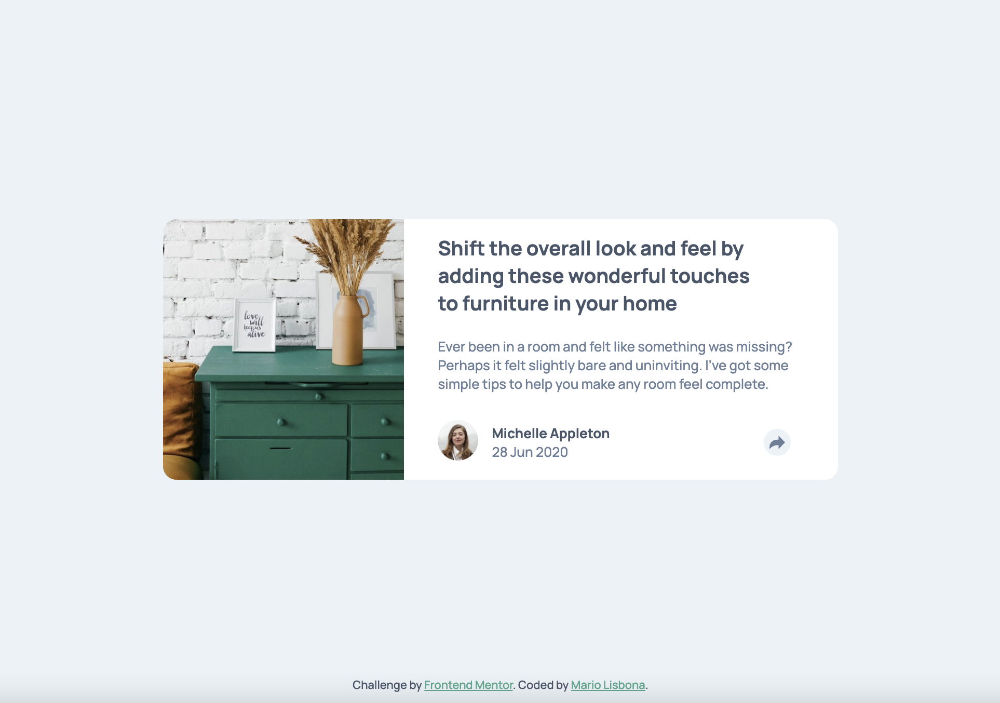
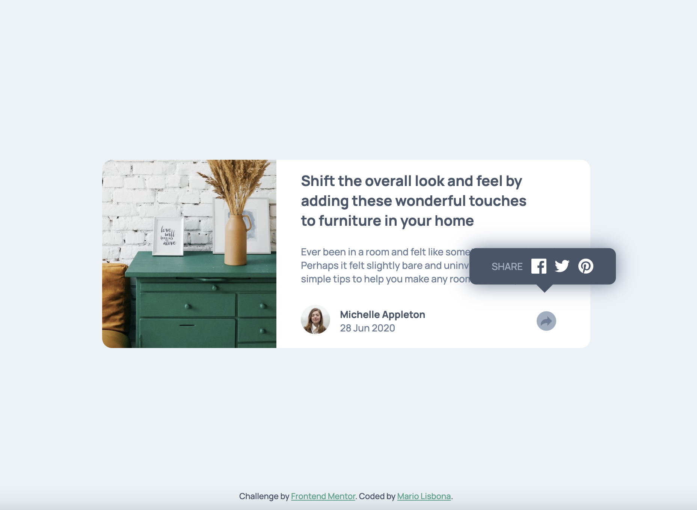
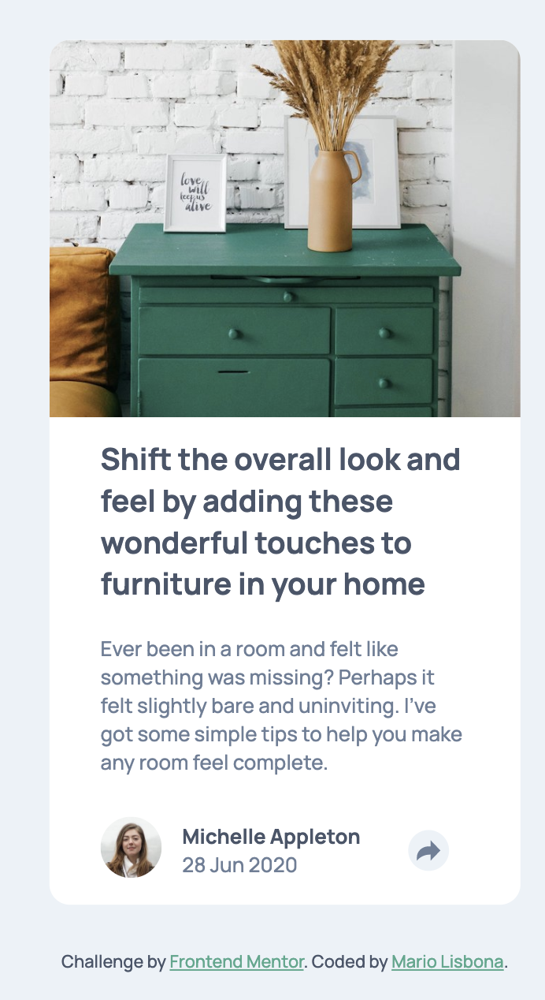
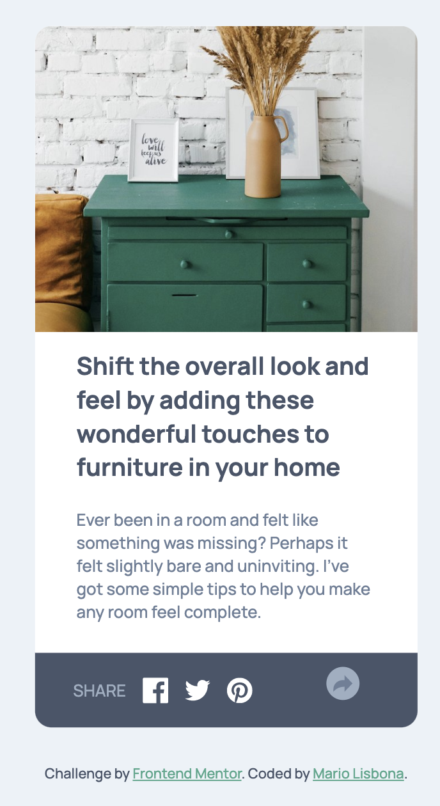

# Frontend Mentor - Article preview component solution

This is a solution to the [Article preview component challenge on Frontend Mentor](https://www.frontendmentor.io/challenges/article-preview-component-dYBN_pYFT). Frontend Mentor challenges help you improve your coding skills by building realistic projects. 

## Table of contents

- [Overview](#overview)
  - [The challenge](#the-challenge)
  - [Screenshot](#screenshot)
  - [Links](#links)
- [My process](#my-process)
  - [Built with](#built-with)
  - [What I learned](#what-i-learned)
  - [Useful resources](#useful-resources)
- [Author](#author)

**Note: Delete this note and update the table of contents based on what sections you keep.**

## Overview

### The challenge

Users should be able to:

- View the optimal layout for the component depending on their device's screen size
- See the social media share links when they click the share icon

### Screenshot

### Links

- Solution URL: [Add solution URL here](https://github.com/MarioLisbona/FEM-Article-preview)
- Live Site URL: [Add live site URL here](https://mariolisbona.github.io/FEM-Article-preview/)

## My process

### Built with

- Semantic HTML5 markup
- CSS custom properties
- Flexbox

### What I learned

I learned to use the ontouchstart attribute to allow the tooltip to popup when touching the social share icon on mobile.

I also learned how to create a fucntion in javascript that will position the tooltip on the screen realtive to the social share icon. Using event listeners, that function is initially called when all the elements of the DOM are first loaded. It is then called every time the window is resized. This allows the position of the tooltip to dynamically change is position depending on where the social share icon is loacted on the page.

### Useful resources

- [Example resource 1](https://www.youtube.com/watch?v=e_jEquJo7y8) - I modified the code in this example to create the tooltip that will always be positioned above the social share container.

## Author

- Frontend Mentor - [@MarioLisbona](https://www.frontendmentor.io/profile/MarioLisbona)
